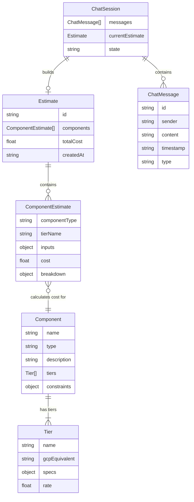
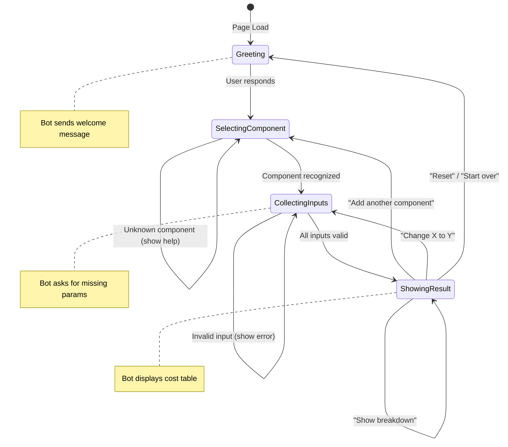

# Data Model: CFO Bot

**Date**: 2026-03-26  
**Feature**: CFO Bot (Cloud Cost Calculator)  
**Source**: [spec.md](./spec.md) — Section 8 (Key Entities)

---

## Entity Relationship Diagram



---

## Entity Definitions

### Component

Represents a cloud service category. These are **static/constant** — defined at build time, not user-created.

| Field | Type | Description | Example |
|-------|------|-------------|---------|
| `name` | string | Display name | `"Compute"` |
| `type` | enum | Component type identifier | `"compute"` \| `"storage"` \| `"bandwidth"` \| `"database"` \| `"serverless"` |
| `description` | string | Brief explanation for "help" command | `"Virtual machines (GCP E2 series)"` |
| `tiers` | Tier[] | Available pricing tiers | See Tier entity |
| `constraints` | object | Min/max validation rules | `{ minInstances: 1, maxInstances: 100 }` |
| `requiredInputs` | InputField[] | What the user must provide | `["instances", "tier", "hours"]` |

### Tier

A pricing level within a component. Also **static/constant**.

| Field | Type | Description | Example |
|-------|------|-------------|---------|
| `name` | string | Tier display name | `"Standard"` |
| `gcpEquivalent` | string | Real GCP product name | `"e2-medium"` |
| `specs` | object | Technical specifications | `{ vCPUs: 1, ramGb: 4 }` |
| `rate` | float | Price per unit | `0.034` |
| `rateUnit` | string | What the rate applies to | `"$/hour"` |

### Estimate

A collection of component cost calculations built during a chat session.

| Field | Type | Description | Example |
|-------|------|-------------|---------|
| `id` | string | Unique identifier | `"est_20260326_001"` |
| `components` | ComponentEstimate[] | Individual component costs | See below |
| `totalCost` | float | Sum of all component costs | `217.52` |
| `createdAt` | string | ISO timestamp | `"2026-03-26T10:00:00Z"` |

### ComponentEstimate

A single calculated cost for one component. Created when the user provides all required inputs.

| Field | Type | Description | Example |
|-------|------|-------------|---------|
| `componentType` | enum | Which component | `"compute"` |
| `tierName` | string | Selected tier | `"Premium"` |
| `inputs` | object | User-provided parameters | `{ instances: 2, hours: 730 }` |
| `cost` | float | Calculated monthly cost (rounded to 2 decimals) | `195.64` |
| `breakdown` | object | Detailed cost breakdown | `{ formula: "2 × $0.134 × 730", perUnit: 0.134 }` |

### ChatMessage

A single message in the conversation.

| Field | Type | Description | Example |
|-------|------|-------------|---------|
| `id` | string | Unique ID | `"msg_001"` |
| `sender` | enum | Who sent it | `"user"` \| `"bot"` |
| `content` | string | Message text or HTML | `"I need 3 Standard VMs"` |
| `timestamp` | string | ISO timestamp | `"2026-03-26T10:00:05Z"` |
| `type` | enum | Message category | `"text"` \| `"breakdown"` \| `"error"` \| `"system"` |

### ChatSession

The top-level state container for the current conversation.

| Field | Type | Description |
|-------|------|-------------|
| `messages` | ChatMessage[] | All messages in order |
| `currentEstimate` | Estimate \| null | The estimate being built |
| `state` | enum | Conversation state: `"greeting"` \| `"selecting_component"` \| `"collecting_inputs"` \| `"showing_result"` |
| `pendingComponent` | string \| null | Component currently being configured |
| `pendingInputs` | object | Inputs collected so far for pending component |

---

## Validation Rules

### Compute Constraints
```
instances: integer, 1 ≤ x ≤ 100
hours:     integer, 1 ≤ x ≤ 730
tier:      one of ["Basic", "Standard", "Premium", "High-Performance"]
```

### Storage Constraints
```
volumeGb:  float, 1 ≤ x ≤ 1,000,000
tier:      one of ["Standard", "Nearline", "Coldline", "Archive"]
```

### Bandwidth Constraints
```
egressGb:  float, 0 ≤ x ≤ 500,000
```

### Database Constraints
```
storageGb: float, 10 ≤ x ≤ 10,000
tier:      one of ["Micro", "Small", "Medium", "Large", "XLarge"]
```

### Serverless Constraints
```
invocations:  integer, 0 ≤ x ≤ 1,000,000,000
durationMs:   integer, 1 ≤ x ≤ 540,000
memoryMb:     one of [128, 256, 512, 1024, 2048]
```

---

## State Transitions


