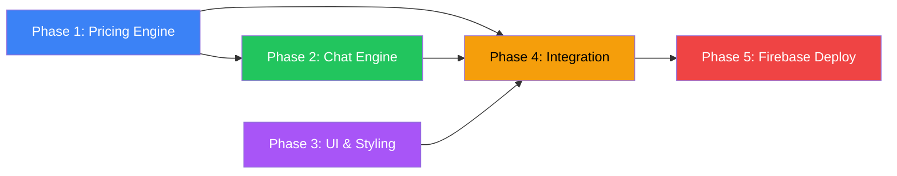

# Implementation Plan: CFO Bot (Cloud Cost Calculator)

**Version**: 1.0  
**Date**: 2026-03-26  
**Status**: Ready for Implementation  
**Spec**: [spec.md](./spec.md)  
**Research**: [research.md](./research.md)  
**Data Model**: [data-model.md](./data-model.md)  
**Contracts**: [contracts/internal-api.md](./contracts/internal-api.md)

---

## Technical Context

| Dimension | Decision | Reference |
|-----------|----------|-----------|
| **Frontend** | Vanilla HTML + CSS + JavaScript (no framework) | R-01 |
| **Bot Architecture** | Rule-based keyword matching + intent extraction | R-02 |
| **Calculation Engine** | Modular pure functions, one per component | R-03 |
| **Deployment** | Firebase Hosting (static files) | R-04 |
| **Testing** | Unit tests for all pricing formulas | R-05 |
| **Styling** | Dark mode, finance aesthetic, responsive | Spec UX-02 |

---

## Project File Structure

```
TSIS3/
├── specs/cfo-bot/           # Specification artifacts (Phase 1)
│   ├── spec.md              # SSOT specification
│   ├── plan.md              # This implementation plan
│   ├── research.md          # Technology decisions
│   ├── data-model.md        # Entity definitions
│   ├── contracts/           # Function interface contracts
│   └── checklists/          # Quality checklists
│
├── public/                  # Firebase Hosting root (deployable)
│   ├── index.html           # Single page application
│   ├── css/
│   │   └── styles.css       # All styles (dark mode, responsive)
│   ├── js/
│   │   ├── app.js           # Main application entry point
│   │   ├── pricing/         # Calculation engine modules
│   │   │   ├── data.js      # Pricing data constants (tiers, rates)
│   │   │   ├── compute.js   # Compute cost calculator
│   │   │   ├── storage.js   # Storage cost calculator
│   │   │   ├── bandwidth.js # Bandwidth cost calculator (tiered)
│   │   │   ├── database.js  # Database cost calculator
│   │   │   ├── serverless.js# Serverless cost calculator
│   │   │   └── index.js     # Calculator aggregator
│   │   ├── chat/            # Chat engine modules
│   │   │   ├── parser.js    # NLP-lite intent parser
│   │   │   ├── bot.js       # Bot response generator
│   │   │   ├── session.js   # Session & estimate state manager
│   │   │   └── responses.js # Response templates & messages
│   │   └── ui/              # UI rendering modules
│   │       ├── messages.js  # Message bubble rendering
│   │       ├── breakdown.js # Cost table rendering
│   │       ├── quickreply.js# Quick-reply button rendering
│   │       └── effects.js   # Animations, auto-scroll, typing indicator
│   └── assets/
│       └── favicon.ico
│
├── tests/                   # Test specifications
│   ├── pricing.test.js      # Unit tests for all 5 calculators
│   ├── parser.test.js       # Chat parser tests
│   └── scenarios.test.js    # End-to-end scenario tests
│
├── firebase.json            # Firebase Hosting configuration
├── .firebaserc              # Firebase project configuration
└── .gitignore
```

---

## Implementation Phases

### Phase 1: Pricing Engine (Core Logic)

**Priority**: Critical — must be mathematically flawless  
**Dependencies**: None  
**Estimated Effort**: Foundation of the project

#### 1.1 Pricing Data Constants (`js/pricing/data.js`)

Define all tiers, rates, and constraints as constant objects:

```javascript
// Compute tiers (GCP E2 series)
export const COMPUTE_TIERS = {
  "Basic":            { gcpName: "e2-micro",      vCPUs: "Shared", ramGb: 1,  rate: 0.008 },
  "Standard":         { gcpName: "e2-medium",     vCPUs: 1,        ramGb: 4,  rate: 0.034 },
  "Premium":          { gcpName: "e2-standard-4", vCPUs: 4,        ramGb: 16, rate: 0.134 },
  "High-Performance": { gcpName: "e2-standard-8", vCPUs: 8,        ramGb: 32, rate: 0.268 }
};

// Memory → CPU auto-allocation (GCP Cloud Functions)
export const SERVERLESS_CPU_MAP = {
  128:  0.2,   // 200 MHz
  256:  0.4,   // 400 MHz
  512:  0.8,   // 800 MHz
  1024: 1.4,   // 1400 MHz
  2048: 2.4    // 2400 MHz
};
```

#### 1.2 Individual Calculators

Implement each as a pure function following the contracts in `contracts/internal-api.md`:

| File | Function | Key Logic |
|------|----------|-----------|
| `compute.js` | `computeCost(params)` | `instances × rate × hours` |
| `storage.js` | `storageCost(params)` | `volumeGb × rate` |
| `bandwidth.js` | `bandwidthCost(params)` | Progressive tier calculation with 4 tiers |
| `database.js` | `databaseCost(params)` | `baseRate + (storageGb × 0.170)` |
| `serverless.js` | `serverlessCost(params)` | 3 separate free tier deductions (invocations, memory, CPU) |

#### 1.3 Input Validation

Each calculator validates inputs against constraints defined in `data-model.md`:
- Range checks (min/max)
- Type checks (integer vs float)
- Enum checks (valid tier names)
- Returns `{ valid: false, error: "message" }` on failure

#### 1.4 Unit Tests

Test every formula against known values from spec Scenarios 1–4:

| Test Case | Input | Expected Output |
|-----------|-------|-----------------|
| Compute: 3 Standard, 730h | `{instances:3, tier:"Standard", hours:730}` | **$74.46** |
| Storage: 500 GB Standard | `{volumeGb:500, tier:"Standard"}` | **$10.00** |
| Bandwidth: 100 GB | `{egressGb:100}` | **$11.88** |
| Bandwidth: 15,000 GB | `{egressGb:15000}` | **$1,517.32** |
| Database: Small, 100 GB | `{tier:"Small", storageGb:100}` | **$87.00** |
| Serverless: 3M inv, 200ms, 256MB | `{invocations:3000000, durationMs:200, memoryMb:256}` | **$0.80** |
| Bandwidth: 0 GB (edge) | `{egressGb:0}` | **$0.00** |
| Bandwidth: 1 GB (boundary) | `{egressGb:1}` | **$0.00** |
| Bandwidth: 1024 GB (boundary) | `{egressGb:1024}` | **$122.76** |
| Serverless: 2M inv (free tier) | `{invocations:2000000, durationMs:100, memoryMb:128}` | **$0.00** |
| Compute: 1 instance min | `{instances:1, tier:"Basic", hours:1}` | **$0.01** |
| Compute: 100 instances max | `{instances:100, tier:"High-Performance", hours:730}` | **$19,564.00** |
| Validation: -5 instances | `{instances:-5, ...}` | **Error** |
| Validation: 0 instances | `{instances:0, ...}` | **Error** |

---

### Phase 2: Chat Engine (Bot Logic)

**Priority**: High  
**Dependencies**: Phase 1 (pricing engine)

#### 2.1 Intent Parser (`js/chat/parser.js`)

Rule-based parser that extracts structured intent from user text:

**Keyword Maps:**
```
Components: compute|vm|server|instance → "compute"
            storage|disk|bucket|gb    → "storage" (with context)
            bandwidth|egress|transfer → "bandwidth"
            database|db|sql           → "database"
            serverless|function|faas  → "serverless"

Actions:    help                      → "help"
            reset|clear|start over    → "reset"
            show|pricing|price|rates  → "show_pricing"
            change|update|modify      → "modify"
            add                       → "select_component"
            remove|delete             → "remove"
            summary|total|breakdown   → "show_breakdown"

Numbers:    /\d+(\.\d+)?/             → extract with context
            "24/7"                    → hours: 730
```

#### 2.2 Bot Response Generator (`js/chat/bot.js`)

State machine based on `ChatSession.state` (see `data-model.md`):

| State | User Intent | Bot Action |
|-------|-------------|------------|
| `greeting` | any | Welcome message + component list |
| `selecting_component` | `select_component` | Ask for tier + parameters |
| `selecting_component` | `help` | Show available components |
| `collecting_inputs` | `provide_input` | Store input, ask for next missing param |
| `collecting_inputs` | all inputs received | Calculate, show result, transition to `showing_result` |
| `showing_result` | `select_component` | Add another component |
| `showing_result` | `modify` | Update component, show new breakdown |
| `showing_result` | `reset` | Clear estimate, go to `greeting` |
| `any` | `show_pricing` | Show the pricing table for requested component |
| `any` | `show_breakdown` | Show current estimate summary |

#### 2.3 Session Manager (`js/chat/session.js`)

Implements the `EstimateManager` contract from `contracts/internal-api.md`.

#### 2.4 Response Templates (`js/chat/responses.js`)

Pre-defined message templates with placeholders:

```javascript
const RESPONSES = {
  welcome: "👋 Welcome to **CFO Bot**! I estimate monthly cloud costs based on GCP pricing.\n\nWhich component would you like to estimate?",
  componentPrompt: "What tier of {component} would you like? Available tiers:\n{tierTable}",
  result: "✅ **{component}** ({tier}): **{cost}**/month\n{formula}",
  breakdown: "📊 Monthly Cost Breakdown\n{table}\n\n💰 **Total: {total}/month**",
  invalidInput: "⚠️ {message}. Valid range: {min}–{max}",
  help: "I can estimate costs for:\n• **Compute** — Virtual Machines\n• **Storage** — Object Storage\n• **Bandwidth** — Data Transfer\n• **Database** — Managed SQL\n• **Serverless** — Cloud Functions\n\nType a component name to get started!",
  reset: "🔄 Estimate cleared! Let's start fresh.\n\nWhich component would you like to estimate?"
};
```

---

### Phase 3: UI & Styling

**Priority**: High  
**Dependencies**: Phase 2 (chat engine)

#### 3.1 HTML Structure (`index.html`)

Single-page layout:
```html
<body>
  <header id="app-header">CFO Bot — Cloud Cost Calculator</header>
  <main id="chat-container">
    <div id="messages"></div>        <!-- Scrollable message area -->
  </main>
  <div id="quick-replies"></div>     <!-- Quick-reply buttons -->
  <footer id="input-bar">
    <input id="user-input" type="text" placeholder="Type a message..." />
    <button id="send-btn">Send</button>
  </footer>
</body>
```

#### 3.2 CSS Design System (`css/styles.css`)

**Color Palette (Dark Finance Theme):**
```css
--bg-primary:    #0f1117;    /* Deep dark background */
--bg-secondary:  #1a1d27;    /* Card/bubble background */
--bg-bot:        #1e2130;    /* Bot message background */
--bg-user:       #2563eb;    /* User message background (blue accent) */
--text-primary:  #e4e4e7;    /* Main text */
--text-secondary:#9ca3af;    /* Muted text */
--accent:        #3b82f6;    /* Primary accent (blue) */
--accent-green:  #22c55e;    /* Positive/success */
--accent-orange: #f59e0b;    /* Warning */
--accent-red:    #ef4444;    /* Error */
--border:        #2d3348;    /* Subtle borders */
```

**Component Colors in Breakdown:**
```css
--color-compute:    #3b82f6;  /* Blue */
--color-storage:    #22c55e;  /* Green */
--color-bandwidth:  #a855f7;  /* Purple */
--color-database:   #f59e0b;  /* Amber */
--color-serverless: #ec4899;  /* Pink */
```

**Typography:**
- Font: `Inter` from Google Fonts (with system fallbacks)
- Base size: 15px
- Cost figures: `font-variant-numeric: tabular-nums` for alignment

**Animations:**
- Message appear: `fade-in` + `slide-up` (200ms ease-out)
- Typing indicator: 3 bouncing dots
- Quick-reply buttons: subtle scale on hover

**Responsive breakpoints:**
- Desktop: max-width 800px centered
- Tablet (< 768px): full-width with 16px padding
- Mobile (< 480px): full-width, larger input targets (48px height)

#### 3.3 UI Modules

| Module | Responsibility |
|--------|---------------|
| `messages.js` | Create and append message bubbles (bot/user/breakdown) |
| `breakdown.js` | Render cost table with component colors |
| `quickreply.js` | Render context-aware quick-reply buttons |
| `effects.js` | Auto-scroll, typing indicator, animations |

---

### Phase 4: Integration & Testing

**Priority**: High  
**Dependencies**: Phases 1–3

#### 4.1 Application Entry Point (`js/app.js`)

Wire up all modules:
1. Initialize `ChatSession` with greeting state
2. Attach event listeners to input bar (Enter key + Send button)
3. On user message: parse → process (bot) → render response
4. Display initial greeting message on page load

#### 4.2 End-to-End Scenario Tests

Verify all 6 scenarios from spec Section 4:
- Scenario 1: Single component → $74.46
- Scenario 2: Multi component → $217.52
- Scenario 3: Bandwidth tiered → $1,517.32
- Scenario 4: Serverless free tier → $0.80
- Scenario 5: Input validation → error messages
- Scenario 6: Adjustment → updated breakdown

---

### Phase 5: Firebase Deployment

**Priority**: Required  
**Dependencies**: Phase 4

#### 5.1 Firebase Setup

```bash
# Install Firebase CLI (if not installed)
npm install -g firebase-tools

# Login to Firebase
firebase login

# Initialize Firebase Hosting
firebase init hosting
# Select: Create a new project or use existing
# Public directory: public
# Single-page app: Yes
# Automatic builds: No

# Deploy
firebase deploy
```

#### 5.2 Firebase Configuration (`firebase.json`)

```json
{
  "hosting": {
    "public": "public",
    "ignore": ["firebase.json", "**/.*", "**/node_modules/**"],
    "rewrites": [
      { "source": "**", "destination": "/index.html" }
    ],
    "headers": [
      {
        "source": "**/*.js",
        "headers": [{ "key": "Cache-Control", "value": "max-age=3600" }]
      }
    ]
  }
}
```

#### 5.3 Verification

- [ ] App accessible at `https://<project-id>.web.app`
- [ ] HTTPS enforced
- [ ] All 6 scenarios pass on live deployment
- [ ] Mobile responsive (test on 375px viewport)

---

## Test Specification Summary

### Unit Tests (pricing.test.js)

| ID | Component | Description | Input | Expected |
|----|-----------|-------------|-------|----------|
| T-01 | Compute | Basic scenario | 3 Standard, 730h | $74.46 |
| T-02 | Compute | Min values | 1 Basic, 1h | $0.01 |
| T-03 | Compute | Max values | 100 High-Perf, 730h | $19,564.00 |
| T-04 | Compute | Validation: negative | -1 instances | Error |
| T-05 | Compute | Validation: zero | 0 instances | Error |
| T-06 | Compute | Validation: over max | 101 instances | Error |
| T-07 | Storage | Standard 500 GB | 500 GB Standard | $10.00 |
| T-08 | Storage | Archive 10,000 GB | 10,000 GB Archive | $12.00 |
| T-09 | Storage | Min: 1 GB | 1 GB Standard | $0.02 |
| T-10 | Storage | Validation: 0 GB | 0 GB | Error |
| T-11 | Bandwidth | Under free tier | 0.5 GB | $0.00 |
| T-12 | Bandwidth | Exactly 1 GB | 1 GB | $0.00 |
| T-13 | Bandwidth | Simple: 100 GB | 100 GB | $11.88 |
| T-14 | Bandwidth | Tier boundary: 1024 GB | 1024 GB | $122.76 |
| T-15 | Bandwidth | Cross tiers: 15,000 GB | 15,000 GB | $1,517.32 |
| T-16 | Bandwidth | Boundary: 10,240 GB | 10,240 GB | $1,136.52 |
| T-17 | Bandwidth | Zero | 0 GB | $0.00 |
| T-18 | Database | Micro + 10 GB | Micro, 10 GB | $14.70 |
| T-19 | Database | Small + 100 GB | Small, 100 GB | $87.00 |
| T-20 | Database | XLarge + 1000 GB | XLarge, 1000 GB | $730.00 |
| T-21 | Database | Min storage | Micro, 10 GB | $14.70 |
| T-22 | Database | Validation: 5 GB | Any tier, 5 GB | Error |
| T-23 | Serverless | Under free tier | 1M inv, 100ms, 128MB | $0.00 |
| T-24 | Serverless | Spec scenario 4 | 3M inv, 200ms, 256MB | $0.80 |
| T-25 | Serverless | No invocations | 0 inv | $0.00 |
| T-26 | Serverless | Large scale | 100M inv, 500ms, 1024MB | Calculated |
| T-27 | Serverless | Validation: negative inv | -1 inv | Error |
| T-28 | Serverless | Validation: bad memory | 300 MB | Error |
| T-29 | Multi | Full scenario 2 | Compute+Storage+Bandwidth | $217.52 |
| T-30 | Multi | Empty estimate | No components | $0.00 |

### Verification Commands (Manual)

```
1. Open deployed URL in browser
2. Type "help" → verify help message displays
3. Type "I need 3 Standard VMs" → verify $74.46
4. Type "add 500 GB Standard storage" → verify $10.00 added
5. Type "add 100 GB bandwidth" → verify $11.88 added, total $96.34
6. Type "change compute to 5 instances" → verify updated total
7. Type "reset" → verify estimate cleared
8. Test on mobile (375px viewport or DevTools)
```

---

## Risk Assessment

| Risk | Impact | Mitigation |
|------|--------|------------|
| Pricing formula errors | High — undermines project credibility | Comprehensive unit tests with known-value assertions |
| Bandwidth tiered calc wrong | High — most complex formula | Test at every boundary (0, 1, 1024, 10240, 500000) |
| Chat parser misunderstands | Medium — frustrating UX | Quick-reply buttons as fallback; explicit commands |
| Firebase deployment fails | Medium — required for grading | Test deployment early; have fallback plan |
| Mobile layout broken | Low — responsive CSS | Test at 375px during development |

---

## Dependencies Between Phases



**Note:** Phase 3 (UI) can be developed in parallel with Phase 2 (Chat Engine).
