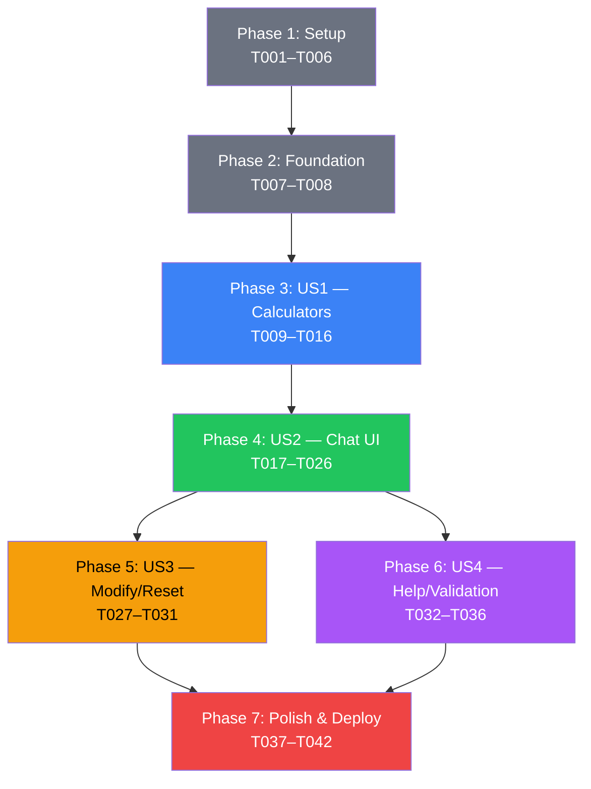

# Tasks: CFO Bot (Cloud Cost Calculator)

**Feature**: CFO Bot — Cloud Cost Chatbot  
**Generated**: 2026-03-26  
**Source Artifacts**:
- [spec.md](./spec.md) — Requirements & pricing models
- [plan.md](./plan.md) — Implementation plan (5 phases)
- [data-model.md](./data-model.md) — Entity definitions & state machine
- [contracts/internal-api.md](./contracts/internal-api.md) — Function contracts

**Total Tasks**: 42  
**Phases**: 7 (Setup → Foundation → 4 User Stories → Polish)

---

## Phase 1: Project Setup

> **Goal**: Initialize project structure, configuration files, and development environment.  
> **Dependencies**: None  
> **Test Criteria**: Project serves locally; all directories and placeholder files exist.

- [ ] T001 Create project directory structure per plan.md (`public/`, `public/css/`, `public/js/pricing/`, `public/js/chat/`, `public/js/ui/`, `public/assets/`, `tests/`)
- [ ] T002 Create `firebase.json` with hosting config pointing to `public/` directory
- [ ] T003 Create `.firebaserc` with placeholder project ID
- [ ] T004 Create `.gitignore` with node_modules, .firebase, firebase-debug.log
- [ ] T005 Create base `public/index.html` with HTML5 boilerplate, meta tags, Google Fonts (Inter), CSS/JS imports, and SEO tags
- [ ] T006 Create `public/css/styles.css` with CSS custom properties (color palette, typography) from plan.md Phase 3.2

---

## Phase 2: Foundation — Pricing Data & Validation

> **Goal**: Define all pricing constants, tier data, and shared validation utilities. These are blocking prerequisites for all calculators.  
> **Dependencies**: Phase 1  
> **Test Criteria**: All pricing data constants are importable; validation utility correctly rejects invalid inputs.

- [ ] T007 Implement pricing data constants in `public/js/pricing/data.js` — all 5 component tiers, rates, constraints, and serverless CPU auto-allocation map per spec.md Section 2
- [ ] T008 Implement input validation utility in `public/js/pricing/validate.js` — range checks, type checks, enum checks returning `{valid, error}` per data-model.md validation rules

---

## Phase 3: User Story 1 — Single Component Cost Estimate (P1)

> **Goal**: "As a user, I can select a single cloud component, provide usage parameters, and receive an accurate monthly cost estimate."  
> **Maps to**: FR-03 (Calculation Engine), FR-04 (Cost Breakdown), Scenario 1  
> **Dependencies**: Phase 2  
> **Test Criteria**: All 5 calculators return correct results for known inputs from spec.md scenarios; `computeCost({instances:3, tier:"Standard", hours:730})` → $74.46

- [ ] T009 [P] [US1] Implement `computeCost(params)` in `public/js/pricing/compute.js` per contract — formula: `instances × rate × hours`, with validation
- [ ] T010 [P] [US1] Implement `storageCost(params)` in `public/js/pricing/storage.js` per contract — formula: `volumeGb × rate`, with validation
- [ ] T011 [P] [US1] Implement `bandwidthCost(params)` in `public/js/pricing/bandwidth.js` per contract — progressive 4-tier formula with boundary calculations at 1/1024/10240 GB
- [ ] T012 [P] [US1] Implement `databaseCost(params)` in `public/js/pricing/database.js` per contract — formula: `baseRate + (storageGb × 0.170)`, with validation
- [ ] T013 [P] [US1] Implement `serverlessCost(params)` in `public/js/pricing/serverless.js` per contract — 3 separate free tier deductions (invocations, memory GB-sec, CPU GHz-sec), CPU auto-allocation from memory
- [ ] T014 [US1] Implement calculator aggregator in `public/js/pricing/index.js` — exports all 5 calculators, provides `calculateComponent(type, params)` dispatcher
- [ ] T015 [US1] Create unit test file `tests/pricing.test.js` with test cases T-01 through T-30 from plan.md Test Specification — verify all formulas against known values from spec scenarios
- [ ] T016 [US1] Implement `formatCurrency(amount)` and `formatBreakdownTable(estimate)` utilities in `public/js/ui/breakdown.js` per contract — USD formatting with commas and 2 decimals

---

## Phase 4: User Story 2 — Conversational Chat Interface (P1)

> **Goal**: "As a user, I can interact with a chat bot that guides me through component selection, collects inputs conversationally, and displays cost results."  
> **Maps to**: FR-01 (Chat Interface), FR-02 (Guided Selection), FR-04 (Breakdown Display), Scenario 1, Scenario 2  
> **Dependencies**: Phase 3 (US1 — calculators must work)  
> **Test Criteria**: User can type a message, bot responds; component can be selected via text or quick-reply; full conversation flow produces a cost breakdown.

- [ ] T017 [US2] Implement intent parser in `public/js/chat/parser.js` per contract — keyword maps for 5 components, actions (help/reset/pricing/modify/add/remove), number extraction with context, tier detection
- [ ] T018 [US2] Implement response templates in `public/js/chat/responses.js` — welcome, componentPrompt, result, breakdown, invalidInput, help, reset messages with placeholder interpolation
- [ ] T019 [US2] Implement session/state manager in `public/js/chat/session.js` per EstimateManager contract — addComponent, removeComponent, updateComponent, getBreakdown, reset, state transitions per data-model.md state diagram
- [ ] T020 [US2] Implement bot response generator in `public/js/chat/bot.js` — state machine (greeting → selectingComponent → collectingInputs → showingResult), processes parsed intents, calls calculators, returns formatted responses
- [ ] T021 [US2] Implement message rendering in `public/js/ui/messages.js` — createBotMessage, createUserMessage, createBreakdownMessage with HTML generation, left/right alignment, message type styling
- [ ] T022 [US2] Implement quick-reply buttons in `public/js/ui/quickreply.js` — context-aware buttons (component names at start, tier names after component selection, "Add more" / "Reset" after result)
- [ ] T023 [US2] Implement UI effects in `public/js/ui/effects.js` — auto-scroll to latest message, typing indicator (3 bouncing dots with 200ms delay), fade-in animation on new messages
- [ ] T024 [US2] Build complete chat UI in `public/index.html` — header, scrollable message area (#messages), quick-reply bar (#quick-replies), input bar with text input + send button, wire up layout
- [ ] T025 [US2] Implement main application entry point in `public/js/app.js` — initialize session with greeting, attach event listeners (Enter key + Send button + quick-reply clicks), message flow: parse → bot process → render response → update quick-replies
- [ ] T026 [US2] Style all chat components in `public/css/styles.css` — dark theme colors, bot/user message bubbles, cost breakdown table with component colors (compute=blue, storage=green, bandwidth=purple, database=amber, serverless=pink), quick-reply buttons, input bar, responsive layout

---

## Phase 5: User Story 3 — Modify & Recalculate (P2)

> **Goal**: "As a user, I can modify my assumptions (change tier, quantity, or remove components) and see an updated cost breakdown without starting over."  
> **Maps to**: FR-05 (Recalculation), FR-07 (Reset), Scenario 6  
> **Dependencies**: Phase 4 (US2 — chat must work)  
> **Test Criteria**: User can say "change compute to 5 instances" and see updated total; "reset" clears estimate; previous messages remain visible.

- [ ] T027 [US3] Add modification handling to `public/js/chat/parser.js` — detect "change X to Y" patterns, extract component + new parameter values
- [ ] T028 [US3] Add modification logic to `public/js/chat/bot.js` — handle "modify" intent: update existing component via session.updateComponent, regenerate breakdown
- [ ] T029 [US3] Add "remove" logic to `public/js/chat/bot.js` — handle "remove component" intent: call session.removeComponent, display updated or empty breakdown
- [ ] T030 [US3] Implement conversation reset in `public/js/chat/bot.js` — handle "reset" intent: call session.reset, display confirmation, show greeting, clear quick-replies
- [ ] T031 [US3] Update quick-reply buttons in `public/js/ui/quickreply.js` — add "Change", "Remove", "Reset" options when in `showingResult` state

---

## Phase 6: User Story 4 — Help, Validation & Edge Cases (P2)

> **Goal**: "As a user, I get clear error messages for invalid inputs, can ask for help, and can view pricing tables for any component."  
> **Maps to**: FR-06 (Validation), FR-08 (Help), Scenario 5  
> **Dependencies**: Phase 4 (US2)  
> **Test Criteria**: Invalid inputs show error with valid range; "help" shows component list; "show compute pricing" shows the pricing table; bot never crashes.

- [ ] T032 [P] [US4] Add pricing table display to `public/js/chat/bot.js` — handle "show_pricing" intent: render the tier/rate table for the requested component as a formatted message
- [ ] T033 [P] [US4] Add contextual help to `public/js/chat/bot.js` — handle "help" intent: display component list with descriptions; handle "what is compute?" style questions with component explanations
- [ ] T034 [US4] Add graceful error handling to `public/js/chat/bot.js` — catch validation errors from calculators, format user-friendly error messages with valid ranges per FR-06 acceptance criteria
- [ ] T035 [US4] Add unknown input handling to `public/js/chat/bot.js` — when parser returns "unknown" action: suggest available commands, show help prompt, never show raw errors
- [ ] T036 [US4] Create parser test file `tests/parser.test.js` — test keyword detection for all 5 components, action keywords, number extraction, edge cases (empty input, gibberish, special characters)

---

## Phase 7: Polish & Deployment

> **Goal**: Final polish, responsive testing, performance check, and Firebase deployment.  
> **Dependencies**: Phases 3–6  
> **Test Criteria**: App deployed to Firebase URL; all 6 spec scenarios pass on live site; mobile responsive at 375px; loads in <3 seconds.

- [ ] T037 Add responsive CSS media queries to `public/css/styles.css` — tablet (<768px: full-width, 16px padding), mobile (<480px: full-width, 48px input height, larger touch targets)
- [ ] T038 Add accessibility attributes to `public/index.html` — ARIA labels on input, send button, message area; role="log" on messages container; keyboard navigation (Tab, Enter)
- [ ] T039 Add favicon and meta tags to `public/index.html` — Open Graph tags, description, theme-color for mobile browser chrome
- [ ] T040 Create end-to-end scenario test file `tests/scenarios.test.js` — verify all 6 scenarios from spec.md Section 4 with exact expected values ($74.46, $217.52, $1,517.32, $0.80, error messages, recalculation)
- [ ] T041 Deploy to Firebase Hosting — `firebase init hosting` → configure project → `firebase deploy` → verify public URL works
- [ ] T042 Final verification on live URL — test all 6 scenarios, mobile viewport (375px), HTTPS, load time <3s

---

## Dependency Graph



---

## Parallel Execution Opportunities

| Phase | Parallelizable Tasks | Reason |
|-------|---------------------|--------|
| Phase 3 (US1) | T009, T010, T011, T012, T013 | Each calculator is in a separate file, no cross-dependencies |
| Phase 5 & 6 | Phase 5 ∥ Phase 6 | US3 and US4 both depend on US2 but not on each other |
| Phase 6 (US4) | T032 ∥ T033 | Pricing display and help are independent features |

---

## Implementation Strategy

### MVP Scope (Minimum Viable Product)
**Phases 1–4** (T001–T026) deliver a fully working CFO Bot:
- All 5 pricing calculators ✓
- Conversational chat interface ✓
- Cost breakdown display ✓
- Quick-reply buttons ✓
- Dark mode UI ✓

### Incremental Additions
- **Phase 5** adds modify/recalculate/reset (quality of life)
- **Phase 6** adds help, validation, error handling (robustness)
- **Phase 7** adds polish, accessibility, deployment (production readiness)

### Suggested Work Order
```
Day 1: T001–T008 (Setup + Foundation)
Day 2: T009–T016 (All 5 calculators + tests) — parallelize T009–T013
Day 3: T017–T026 (Full chat UI)
Day 4: T027–T036 (Modify, help, validation) — parallelize Phase 5 & 6
Day 5: T037–T042 (Polish + Firebase deploy)
```

---

## Task Summary

| Phase | Name | Tasks | Parallelizable |
|-------|------|-------|---------------|
| 1 | Setup | 6 (T001–T006) | — |
| 2 | Foundation | 2 (T007–T008) | — |
| 3 | US1: Calculators | 8 (T009–T016) | 5 tasks (T009–T013) |
| 4 | US2: Chat UI | 10 (T017–T026) | — |
| 5 | US3: Modify/Reset | 5 (T027–T031) | — |
| 6 | US4: Help/Validation | 5 (T032–T036) | 2 tasks (T032–T033) |
| 7 | Polish & Deploy | 6 (T037–T042) | — |
| **Total** | | **42 tasks** | **7 parallelizable** |
